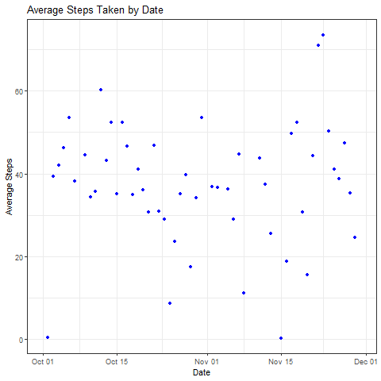
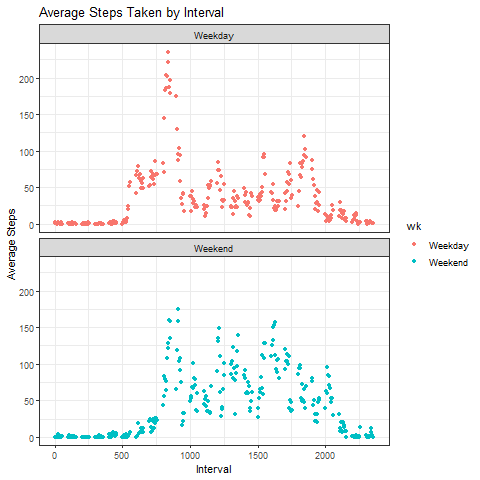

## Updated file to describe the project

## Loading and preprocessing the data
activity <- read_csv("activity.csv")

## What is mean total number of steps taken per day?
Lines 96-113
Plot3.png

## What is the average daily activity pattern?
It appears that on most days there are an average of 40 steps per day.  

## Imputing missing values
The data set contains 2 months of data broken down into 5 minute increments. 
Step 1: check dates to determine there is a pattern to the missing data
Findings: 8 days missing 288 records each
Step 2: group by day of the week and determine average number of steps per 5 minute increment.
Step 3: Impute data for missing day of the week
lines 131-169

## Are there differences in activity patterns between weekdays and weekends?
People appear to move more on the weekend  
lines 191-222  

