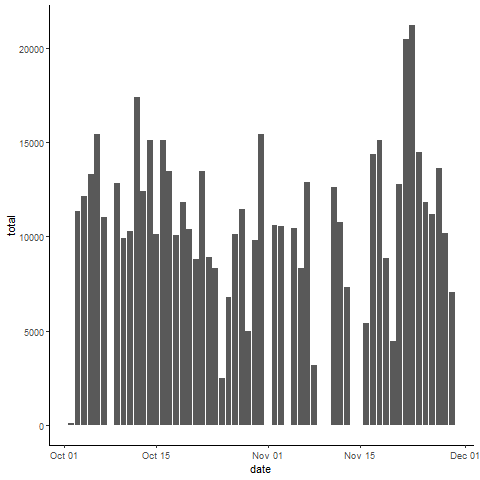
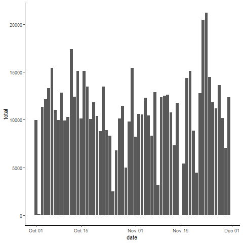

## Updated file to make grading easier.

### Current SHA-1 : 0ae483e806dc356d1a9318beb11ef6d06c06ad0e
If i update the file I lose any feedback from other graders.  

### CLICK THIS LINK TO VIEW HTML FROM REPO  ######
https://htmlpreview.github.io/?https://github.com/HanOlo/RepData_PeerAssessment1/blob/master/PA1_template.html

Or open [PA1_template.md](./PA1_template.md)

Or view highlights from below

## Code to load files
activity <- read_csv("activity.csv")

### Histogram of the total number of steps taken each day

Plot 1 -  Histogram of the total number of steps taken each day   
  
  

### Mean and median number of steps taken each day 
  
Plot 2 - Mean and median number of steps taken each day  
   

###  Time series plot of the average number of steps taken

Plot 3 - Time series plot of the average number of steps taken  

### The 5-minute interval that, on average, contains the maximum number of steps

2355

### Code to describe and show a strategy for imputing missing data

The data set contains 2 months of data broken down into 5 minute increments. 
Step 1: check dates to determine there is a pattern to the missing data
Findings: 8 days missing 288 records each  
Step 2: group by day of the week and determine average number of steps per 5 minute increment.  
Step 3: Impute data for missing day of the week  
lines 131-169

### Histogram of the total number of steps taken each day after missing values are imputed

Plot 4 - Histogram of the total number of steps taken each day after missing values are imputed  
  

### Panel plot comparing the average number of steps taken per 5-minute interval across weekdays and weekends

People appear to move more on the weekend.    
lines 191-222  

### View R Code by clicking on either of the links above.
